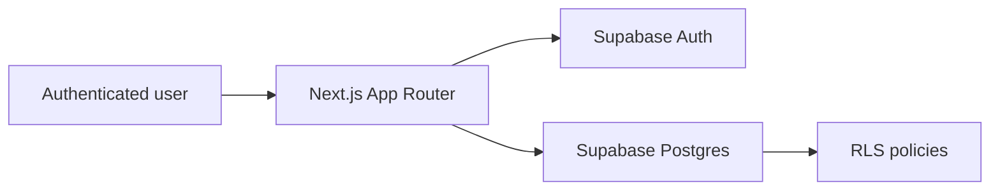
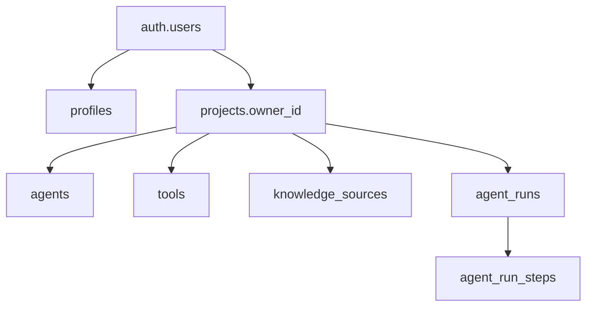

# AIMS Architecture

## System overview

AIMS is a serverless full-stack application. Next.js renders the interface and coordinates authenticated data access. Supabase Cloud provides authentication, PostgreSQL, database functions, and Row Level Security (RLS). Vercel hosts the Next.js application.



There is no custom API server. The browser or Next.js server components use the Supabase client with the logged-in user's session. PostgreSQL remains the security boundary.

## Frontend architecture

- **App Router:** route groups separate public authentication pages from protected application pages.
- **Server Components:** preferred for initial authenticated reads and dashboard aggregation.
- **Client Components:** used only for forms, filters, dialogs, and interactions.
- **Server Actions or Route Handlers:** perform validated mutations while preserving the user's Supabase session.
- **Shared UI:** metric cards, status badges, risk badges, tables, empty states, and forms.
- **Typed data layer:** one Supabase client for browser usage and one for server usage; generated database types can be added after schema creation.

The frontend does not simulate a separate backend. It validates user input for usability, while constraints and RLS enforce integrity and authorization in Postgres.

## Supabase backend architecture

Supabase Cloud owns:

- Email/password identities in `auth.users`
- User-facing identity data in `public.profiles`
- Default workspace creation through an auth trigger
- Project-owned tables for agents, tools, knowledge sources, runs, and run steps
- RLS policies that isolate each owner's projects
- A guarded database function that inserts demo data for the current user's project

## Authentication flow

1. The user signs up with email and password through Supabase Auth.
2. Supabase creates a row in `auth.users`.
3. A database trigger creates the user's `profiles` row and default `projects` row.
4. Supabase returns a session stored in secure auth cookies.
5. Next.js middleware refreshes the session and redirects unauthenticated users away from protected routes.
6. Sign-out clears the session and returns the user to `/login`.

## Data ownership flow



Every business record resolves to a project. A run also references an agent from the same project. The application selects the user's default project, then scopes all queries and mutations to its ID.

## RLS and security model

- RLS is enabled on every public table.
- A user may view or update only their own profile.
- A user may access a project only when `projects.owner_id = auth.uid()`.
- Child-table policies use `owns_project(project_id)` to verify ownership.
- Foreign keys and a composite agent/project relationship prevent a run from referencing an agent in another project.
- The browser receives only the Supabase URL and anon/publishable key.
- The service-role key is never used by the MVP application and never exposed to the browser.
- SQL constraints restrict statuses, risk levels, non-negative latency, and non-negative cost.
- Demo seeding verifies ownership before inserting records.

RLS is the authorization boundary; filtering by `project_id` in React is not considered security.

## Page routes

| Route | Purpose | Access |
|---|---|---|
| `/` | Product landing page | Public |
| `/login` | Email/password login | Public |
| `/signup` | Account creation | Public |
| `/dashboard` | Operational metrics and recent runs | Protected |
| `/agents` | Agent registry and create/edit form | Protected |
| `/tools` | Tool governance registry | Protected |
| `/knowledge` | Knowledge-source registry | Protected |
| `/runs` | Run list and manual run logger | Protected |
| `/runs/[id]` | Run details and execution steps | Protected |
| `/audit` | Chronological execution timeline | Protected |

## Suggested component structure

```text
app/
  (auth)/login/page.tsx
  (auth)/signup/page.tsx
  (dashboard)/layout.tsx
  (dashboard)/dashboard/page.tsx
  (dashboard)/agents/page.tsx
  (dashboard)/tools/page.tsx
  (dashboard)/knowledge/page.tsx
  (dashboard)/runs/page.tsx
  (dashboard)/runs/[id]/page.tsx
  (dashboard)/audit/page.tsx
components/
  app-sidebar.tsx
  metric-card.tsx
  status-badge.tsx
  risk-badge.tsx
  data-table.tsx
  forms/
lib/
  supabase/client.ts
  supabase/server.ts
  supabase/middleware.ts
  queries/
  validation/
middleware.ts
types/database.ts
```

This is a target structure, not a requirement to create abstraction before it is needed.

## Deployment plan

1. Create one Supabase Cloud project.
2. Run the schema from `docs/03_DATABASE_SCHEMA.md` in the Supabase SQL Editor.
3. Configure the application URL and Vercel callback URLs in Supabase Auth.
4. Add public Supabase environment variables locally and in Vercel.
5. Deploy the Next.js repository to Vercel.
6. Verify signup, redirect behavior, RLS isolation, demo seeding, and dashboard metrics on the deployed URL.

## Intentionally excluded from the MVP

The architecture does not include an agent runtime, real AI provider, background jobs, vector database, custom server, streaming, webhooks, payments, organization membership, or complex permissions. The run logger records operational evidence; it does not execute agents. These boundaries make the project credible and finishable in one day.
